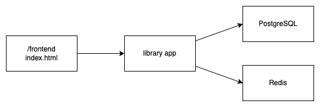

# Library Application

## Architecture



## How to run

1. Run PostgreSQL

```
$ docker run --name my-postgres -p 5432:5432 \
    -e POSTGRES_PASSWORD=1234 \
    -e POSTGRES_DB=library \
    -d postgres
```

2. Run Redis
```
$ docker run --name my-redis -p 6379:6379 -d redis
```

3. Setup `.env` file
```
PORT=3000

POSTGRES_DSN=host=localhost user=postgres password=1234 dbname=library port=5432 sslmode=disable TimeZone=Asia/Bangkok

REDIS_HOST=localhost
REDIS_PORT=6379
```

5. Run application
```
$ go run main.go
```

6. Open `frontend/index.html`

## How to run with docker compose
```
$ docker compose up
```